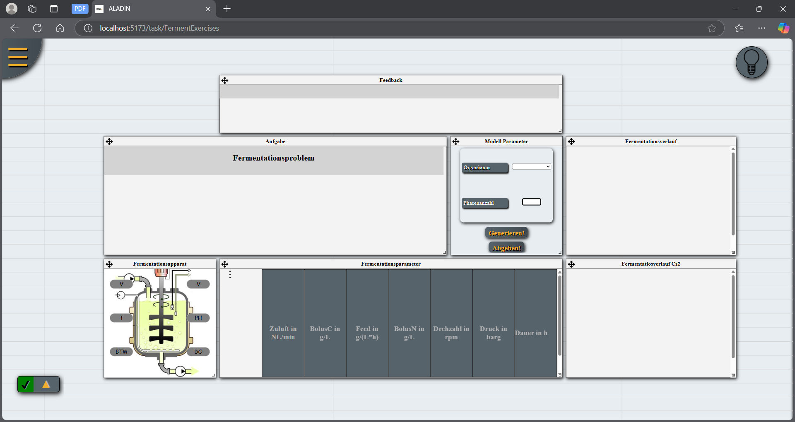

= Anwenderdokumentation

== Einführung
FermentAladin ist eine webbasierte Anwendung, die Studierenden ermöglicht, Fermentationsprozesse unbegrenzt zu simulieren und zu experimentieren. Zudem bietet die Plattform Professoren die Möglichkeit, gezielte Aufgaben für Studierende zu erstellen. Der Fokus liegt auf der Optimierung von Parametern, um bestmögliche Ergebnisse zu erzielen. Studierende profitieren dabei von einem interaktiven Lernprozess: Nach jeder Überprüfung ihrer Lösung erhalten sie ein detailliertes Feedback, das ihnen zeigt, wie nah sie an der optimalen Lösung sind.

FermentAladin besteht aus zwei Modulen:

. **Ferment-Modul**: In diesem Modul können Studierende ihre Eingaben variieren und Fermentationsprozesse unbegrenzt experimentell erkunden. Die Ergebnisse werden in Diagrammen visualisiert, um eine bessere Analyse zu ermöglichen.

. **FermentExercises**: Dieses Modul bietet zwei Benutzeroberflächen und ermöglicht es Professoren, gezielte Aufgaben zu erstellen, die von Studierenden gelöst werden sollen.

.. *Professoren-Oberfläche*: Hier können Professoren Aufgaben generieren und deren Parameter definieren.
.. *Studierenden-Oberfläche*: Studierende versuchen, die gestellten Aufgaben zu lösen und erhalten Feedback zu ihrer Lösung.

== FermentExcercises
=== Professoren-Oberfläche

image::./images/ProfessorenSeite.png[]

In der Professoren-Oberfläche stehen den Professoren drei Hauptkomponenten zur Verfügung:

. *Aufgabenkonfiguration* :
Festlegung der Anzahl der Phasen und der Art des Organismus.
Eingabe der globalen Parameterwerte, die für alle Phasen gelten.
Auswahl der zu optimierenden Parameter, z. B. welche Werte maximiert oder minimiert werden sollen.

. *Optimierungsparameter* :
Hier können Professoren definieren, welche Parameter bei der Optimierung berücksichtigt werden.
* *Beispiel*: Wenn der Feed-Wert zwischen 0 und 5 liegen soll, wird das Parameter „Feed“ ausgewählt, mit einem Mindestwert von 0 und einem Höchstwert von 5.

. *Phasenbezogene Parameter* :
Eine Tabelle, in der für jede Phase spezifische Werte der Parameter eingetragen werden können.

Nachdem der Professor/in das Ausfüllen abgeschlossen hat, kann er/sie auf den Button „Generieren!“ klicken. Dadurch wird die Aufgabe erstellt und direkt auf der Seite der Studierenden angezeigt.

Das folgende Bild zeigt ein Beispiel für das Ausfüllen der Aufgabe.

image::./images/ProfessorenSeite2.png[]

== Studierenden-Oberfläche

In der Studierenden-Oberfläche wird die Seite wie folgt angezeigt, solange noch keine Aufgabe von der Professorin oder dem Professor generiert wurde.

Sobald eine Aufgabe generiert wurde, sieht die Seite wie folgt aus.

image::./images/StudierendenSeite2.png[]

In der Studierenden-Oberfläche stehen dem Studierenden sieben Komponenten zur Verfügung:

. **Organismus und Phasen** : Diese Informationen sind nur zum Lesen zugänglich und zeigen den ausgewählten Organismus sowie die Phasen.

* *Buttons* :

** *Diagramm* : Sobald der Studierende seine Eingaben abgeschlossen hat, kann er auf diesen Button klicken, um Diagramme basierend auf seinen Eingaben anzuzeigen.
** *Feedback* : Beim Klicken auf diesen Button wird dem Studierenden Feedback zu seinen Eingaben angezeigt, das ihm zeigt, wie nahe er der Lösung ist und ob seine Eingaben für jede Phase korrekt sind.

. **Feedback** : Hier wird eine detaillierte Rückmeldung zur Lösung des Studierenden angezeigt.

. **Aufgabenstellung** : Die Aufgabe, die der Studierende lösen muss, wird angezeigt.

. **Parameter für alle Phasen** : Diese Komponente zeigt die Parameter, die für alle Phasen gelten.

. **Tabelle für Phasen und Parameter**: Hier können die Werte für die einzelnen Phasen und Parameter eingetragen werden.  Jede Spalte hat einen festgelegten Bereich. Wenn der eingegebene Wert innerhalb des zulässigen Bereichs liegt, wird das Feld *grün* angezeigt. Liegt der Wert außerhalb des Bereichs, wird das Feld *rot* markiert. 

. **Diagramm-Anzeige** : Diese beiden Komponenten dienen der Anzeige der Diagramme, die die Ergebnisse der Eingaben visuell darstellen.

Wenn der Studierende mit der Aufgabe fertig ist, kann er auf „Diagramm“ und „Feedback“ klicken. Die Anzeige wird dann wie folgt aussehen.

image::./images/StudierendenSeite3.png[]

Wenn ein Feld korrekt ausgefüllt ist, erhält der Studierende ein Feedback, dass die Eingabe richtig war. Das Feld wird daraufhin gesperrt, und der Studierende muss sich auf die verbleibenden Felder konzentrieren, um die Aufgabe zu lösen. Bei den Diagrammen hat der Studierende zudem die Möglichkeit, das Diagramm herunterzuladen.

== Im folgenden Sequenzdiagramm wird der Ablauf dargestellt

