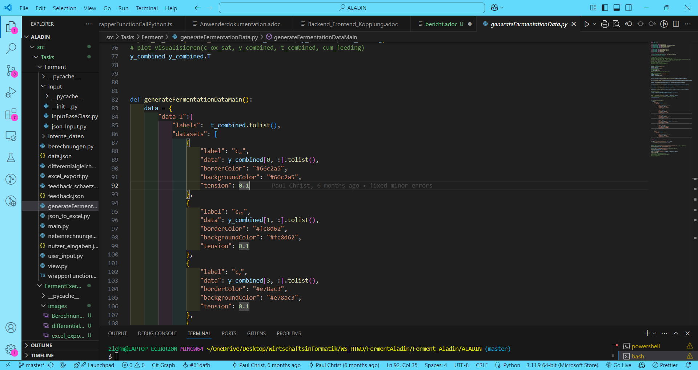
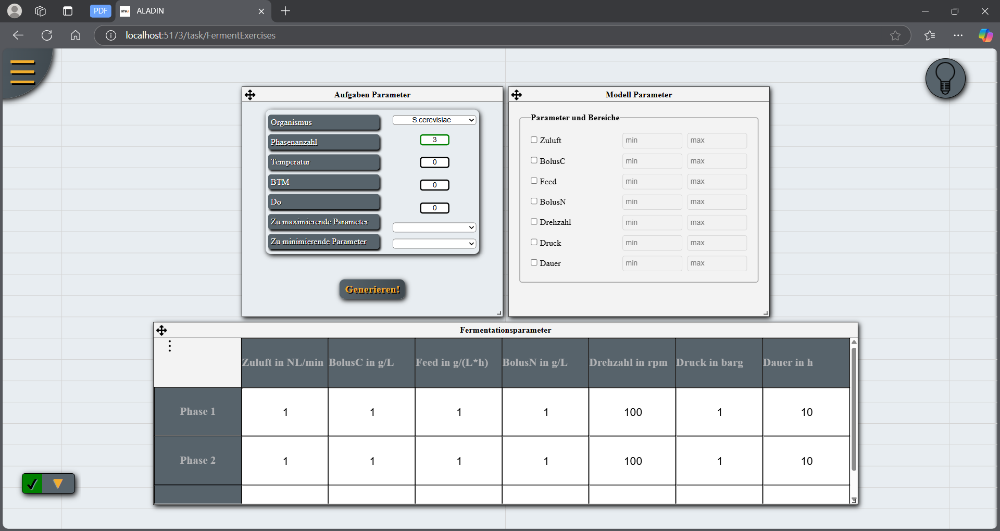
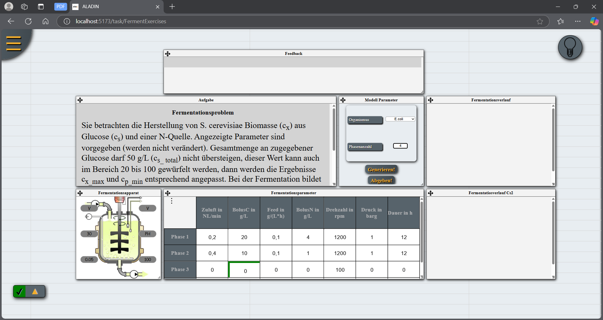
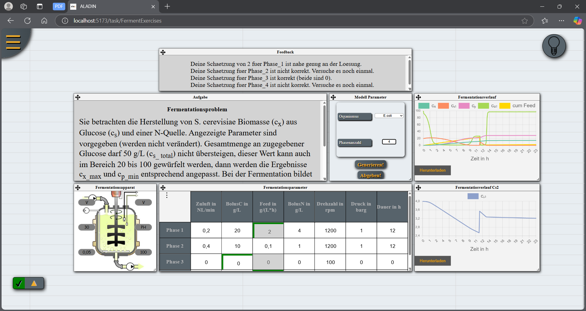

= Bericht
:toc: 
:toc-title: 

== Motivation

Die Ausbildung im Bereich der chemischen Prozesse, insbesondere der Fermentation, steht vor großen Herausforderungen. Fermentationsreaktoren sind teuer, und die Experimente erfordern oft viel Zeit, sodass Studierende in klassischen Lehrveranstaltungen nur begrenzt praktische Erfahrungen sammeln können. Dies erschwert den Aufbau nachhaltigen Wissens.

Um diesem Problem zu begegnen, wurde FermentALADIN entwickelt. Sie ermöglicht es, chemische Prozesse - insbesondere Fermentationsprozesse - virtuell und interaktiv zu simulieren. Studierende können durch wiederholte Simulationen verschiedene Parameterkombinationen ausprobieren und so wertvolle Erfahrungen sammeln, ohne auf teure und zeitaufwendige Experimente angewiesen zu sein.

Mit dieser Plattform wird ein praxisnahes Lernen ermöglicht, das sowohl die analytischen als auch die problemlösungsorientierten Fähigkeiten der Studierenden fördert.

== Implementierung der Python-Code

In unserem Projekt geht es darum, Fermentation-Prozesse digital zu machen. Um das zu schaffen, mussten wir erstens ein paar Python-Skripte implementieren. Die ersten zwei Python-Skripte, die wir implementiert haben, sind *Berechnungen.py* und *Differential-Gleichung.py*.

[pagebreak]
=== Differential-Gleichung.py

*Die Funktion ODE_Bioreactor_Monod* beschreibt ein mathematisches Modell zur Simulation eines Bioreaktors basierend auf der Monod-Kinetik. Sie nimmt als Eingabe die Zeit t, die aktuellen Prozessparameter p sowie eine Reihe von Konstanten consts und berechnet die zeitliche Änderung verschiedener biologischer und chemischer Konzentrationen.

Zu Beginn werden wichtige biotechnologische Parameter aus consts extrahiert, darunter Sauerstofflöslichkeit, Begasungsrate, Ausbeutungskoeffizienten und Wachstumsraten. Anschließend werden die aktuellen Konzentrationen für Biomasse, Substrate, Produkt und gelösten Sauerstoff aus p zugewiesen. Die Berechnungen umfassen die spezifische Wachstumsrate der Mikroorganismen nach der Monod-Gleichung sowie die Sauerstofftransferrate (OTR) und den Sauerstoffverbrauch (OUR).

Das Modell berücksichtigt zudem die Substratverbrauchsraten, die Produktbildungsrate nach Luedeking-Piret sowie die Bilanzierung der gelösten Sauerstoffkonzentration. Weiterhin wird der Gehalt an Sauerstoff und CO₂ in der Abluft nach einem CSTR-Ansatz berechnet. Schließlich gibt die Funktion ein Array zurück, das die Änderungsraten der Biomasse, Substratkonzentrationen, Produktkonzentration, Sauerstoffkonzentration sowie die Gaskonzentrationen in der Abluft enthält.

[pagebreak]
=== Berechnungen.py 

image::./images/Berechnung_py.png[]

==== Funktion: berechnung_der_Tabelle1
Diese Funktion erstellt eine mehrdimensionale Liste (const_array), die verschiedene Parameter für jede Phase eines Prozesses speichert. Die Werte werden aus der Eingabe (parameter_werte, zuluft, feed) sowie einer Datenquelle (data) entnommen. In der ersten Phase werden spezifische Werte aus data extrahiert, während in den folgenden Phasen bestimmte Parameter aus der vorherigen Phase übernommen werden. Abschließend werden alle Werte auf neun Dezimalstellen gerundet.

==== Funktion: berechnung_der_Tabelle2
Hier wird ein Zeitbereichs-Array (t_ranges_array) für jede Phase berechnet. Die Dauer jeder Phase (dauer) wird iterativ summiert, um Start- und Endzeiten zu bestimmen. Die erste Phase beginnt bei null, während die folgenden Phasen an die Endzeit der vorherigen Phase anschließen. Das Ergebnis ist eine Liste von Intervallen, die den zeitlichen Ablauf des Prozesses strukturieren.

==== Funktion: berechnung_der_Tabelle3
Diese Funktion erzeugt ein Array (param_array), das initiale Bedingungen für jede Phase speichert. Für die erste Phase werden die Startbiomasse sowie Werte für Substrate (bolus_c, bolus_n), Sauerstoff (do) und weitere Parameter aus const_array gesetzt. In den folgenden Phasen werden nur bestimmte Werte (bolus_c und bolus_n) aktualisiert, während andere unverändert bleiben.

==== Fubktion: berechnung
1. Initialisierung und Umwandlung der Eingabedaten
Die Funktion berechnung beginnt mit der Definition der Datenrate, die die Anzahl der Datenpunkte pro Stunde bestimmt. Danach werden die Eingabedaten t_ranges_array, param_array und const_array_array in NumPy-Arrays umgewandelt, um eine effizientere Verarbeitung zu ermöglichen. Zusätzlich werden leere Arrays für t_combined (gesamte Zeitpunkte), y_combined (Ergebnisse der Berechnung) und cum_feeding (kumulierte Substratzufuhr) erstellt. Diese Variablen werden später verwendet, um die simulierten Werte über alle Phasen hinweg zu speichern.

2. Iteration über die Phasen
Die Berechnung erfolgt über mehrere Phasen hinweg, wobei jede Phase in einer Schleife durchlaufen wird. In der ersten Phase (i == 0) wird der Startwert y0 direkt aus dem Parameterarray übernommen. Für alle weiteren Phasen (i > 0) werden die Startwerte aus den zuletzt berechneten Werten (ry[-1]) der vorherigen Phase extrahiert. Dabei werden Parameter wie die Biomasse, die Substratkonzentration und der gelöste Sauerstoff neu gesetzt, wobei Zugaben von Substrat berücksichtigt werden.

3. Lösung des Differenzialgleichungssystems
Für jede Phase wird die Differentialgleichung mit der Funktion solve_ivp gelöst, die das System ODE_Bioreactor_Monod numerisch integriert. Der Simulationszeitraum wird durch t_start und t_end bestimmt, und die Zeitpunkte für die Berechnung werden mit np.linspace erzeugt. Die erhaltenen Ergebnisse (sol.y und sol.t) werden in ry und rt gespeichert. Diese Werte enthalten die Konzentrationen verschiedener Stoffe über die Zeit.

4. Speichern und Zusammenführen der Ergebnisse
Die berechneten Werte jeder Phase werden an die Gesamtarrays y_combined und t_combined angehängt. Dabei werden die Werte mit np.vstack (vertikal zusammenfügen) und np.hstack (horizontal zusammenfügen) kombiniert. Zudem wird die kumulierte Substratzufuhr (cum_feeding) durch Multiplikation der Zeitwerte mit dem Feed-Parameter berechnet. Dadurch entsteht eine fortlaufende Simulation über alle Phasen hinweg.

5. Rückgabe der berechneten Daten
Am Ende gibt die Funktion wichtige Berechnungsergebnisse zurück: c_ox_sat (Sauerstoffsättigungskonzentration), y_combined (alle berechneten Konzentrationen), t_combined (Zeitpunkte der Berechnung) und cum_feeding (kumulierte Fütterung). Diese Daten können anschließend für weitere Analysen oder zur Visualisierung der Fermentationsprozesse verwendet werden.

In diesen zwei Skripten geht es darum, dass eine Differential-Gleichung läuft und Ergebnisse abgibt. Danach mussten wir diese Ergebnisse in einem Diagramm zeigen. Und hier kommt *View.py*. Dieser View.py nimmt diese Ergebnisse und gibt ein diagramm.

Für **die Plotin** nützen wir die Bibliothek matplotlib.

=== View.py

Die Funktion plot_visualisieren dient der grafischen Darstellung von Fermentationsverläufen anhand der berechneten Konzentrationen von Biomasse, Substrat und Produkt über die Zeit. Zunächst werden die übergebenen Daten (y_combined und t_combined) in die richtige Form gebracht, sodass sie für das Plotten genutzt werden können. Anschließend werden allgemeine Darstellungsoptionen für die Diagramme, wie Schriftgröße, Linienstärke und Farbpalette, festgelegt.

*Es werden zwei Subplots erstellt*: Der erste zeigt den Verlauf der Biomassekonzentration (c_x), der Substratkonzentrationen (c_S1) und (c_S2), der Produktkonzentration (c_P), sowie den Sauerstoffgehalt (c_O2) und die kumulierte Substratzufuhr (cum_feeding). Die Daten werden farblich codiert, und die Legende wird unterhalb des Plots positioniert.

Der zweite Subplot konzentriert sich auf den Verlauf der zweiten Substratkomponente (c_S2) über die Zeit. Beide Diagramme enthalten Achsenbeschriftungen, eine Gitternetzlinie für bessere Lesbarkeit und eine Begrenzung der y-Achse, sodass keine negativen Werte dargestellt werden. Schließlich wird das Diagramm ausgegeben, um eine visuelle Analyse des Fermentationsprozesses zu ermöglichen.

=== excel_export.py
Wir müssen die Ergebnisse der Fermentation als CSV-Datei exportieren und dafür brauchen wir Excel excel_export.py

Die Funktion *export_to_excel* exportiert die übergebenen Daten als Excel-Datei in den Downloads-Ordner des Benutzers. Zunächst wird geprüft, ob dieser Ordner existiert; falls nicht, wird eine Fehlermeldung ausgegeben. Danach wird der vollständige Pfad zur Zieldatei erstellt, und eine eventuell vorhandene Datei mit demselben Namen wird gelöscht, um Konflikte zu vermeiden.

Die Excel-Datei wird mit der Bibliothek openpyxl erstellt, wobei eine neue Arbeitsmappe (Workbook) und ein Arbeitsblatt (ws) angelegt werden. In der ersten Zeile werden die Spaltenüberschriften definiert, die relevante Messwerte wie Biomassekonzentration, Substratkonzentrationen und kumulatives Feeding enthalten.

Anschließend werden die Daten zeilenweise in die Excel-Tabelle geschrieben. Dabei werden die Zeitwerte (t_combined), die Messwerte (y_combined) und das kumulative Feeding (cum_feeding) kombiniert. Schließlich wird die Datei gespeichert, und der Speicherort wird in der Konsole ausgegeben.

=== inputBaseClass.py & json_input.py

Zur Erfassung der benötigten Daten für den Fermentationsprozess wird eine Klasse verwendet. Diese Klasse nimmt die Benutzereingaben entgegen und speichert die Daten anschließend in einer JSON-Datei, um sie später für die Berechnungen zur Verfügung zu stellen.

==== inputBaseClass.py

InputBase-Klasse und Vererbung: Die InputBase-Klasse ist eine abstrakte Basisklasse, die als Vorlage für andere Eingabeklassen dient. Sie definiert zwei abstrakte Methoden: find_pfad und ladeJson, die von jeder Unterklasse implementiert werden müssen. Diese Struktur stellt sicher, dass alle abgeleiteten Klassen ein einheitliches Interface bieten, um mit Eingabedaten zu arbeiten.

==== json_input.py

* JsonInput-Klasse: Die JsonInput-Klasse erbt von InputBase und implementiert die abstrakten Methoden, um mit JSON-Dateien zu arbeiten. Im Konstruktor wird der Name der JSON-Datei festgelegt. Zusätzlich enthält die Klasse Methoden zur Verwaltung und zum Laden von JSON-Daten sowie zum Speichern und Abrufen von Attributen wie dem Dateinamen und den geladenen Daten.

* find_pfad-Methode: Die Methode find_pfad sucht rekursiv im Projektverzeichnis nach einer Datei mit dem angegebenen Namen. Sie gibt den vollständigen Dateipfad zurück, wenn die Datei gefunden wird, andernfalls wird None zurückgegeben. Dies ermöglicht eine effiziente Suche nach der Datei, ohne dass der Benutzer den Pfad manuell eingeben muss.

* ladeJson-Methode: Die ladeJson-Methode nutzt die find_pfad-Methode, um den Pfad der JSON-Datei zu ermitteln. Wenn die Datei gefunden wird, wird sie geöffnet und die Daten werden in ein Python-Objekt umgewandelt. Falls die Datei nicht existiert oder nicht geladen werden kann, gibt es eine Fehlermeldung. Die geladenen Daten werden in einer privaten Instanzvariablen gespeichert.

* get_Value-Methode: Die get_Value-Methode konvertiert die geladenen JSON-Daten in eine flache Liste. Sie durchsucht die Daten und extrahiert die Werte, selbst wenn sie in verschachtelten Dictionaries enthalten sind. Die Methode sorgt zudem dafür, dass alle Werte korrekt in den entsprechenden Datentyp konvertiert werden, z. B. Ganzzahlen oder Listen von Floats. Das Ergebnis ist eine Liste, die die extrahierten Werte enthält.

=== main.py

In der Datei main.py werden verschiedene Funktionen aus unterschiedlichen Modulen aufgerufen, um den gesamten Berechnungs- und Visualisierungsprozess zu steuern. Die Funktion plot_visualisieren aus view dient der grafischen Darstellung der Ergebnisse, während export_to_excel aus excel_export die berechneten Daten in eine Excel-Datei exportiert.

Für zusätzliche Berechnungen werden verschiedene Funktionen aus nebenrechnungen und berechnungen verwendet. Dazu gehören die Berechnung der Sauerstofflöslichkeit, des kla-Wertes sowie weitere Parameter. Zudem werden drei Tabellen berechnet, die zentrale Ergebnisse liefern.

Zur Datenverarbeitung wird data_importieren_von_json aus interne_daten genutzt, um Daten aus JSON-Dateien zu laden. JsonInput aus Input.json_Input ermöglicht die Verarbeitung von Eingaben im JSON-Format.

== Integration der Python-Code in ALADIN-Framework

*ALADIN* besteht aus zwei Hauptkomponenten: dem Frontend, genannt CARPET, und dem Backend, genannt ALADIN. Für die Integration unseres Python-Codes in das ALADIN-Framework haben wir spezifische JSON-Dateien erstellt, darunter eine namens Ferment. Diese Dateien dienen dazu, die Funktionalität des Python-Codes innerhalb des Frameworks zu definieren und zu steuern. Im Frontend, also in CARPET, haben wir entsprechende Vue-Komponenten entwickelt, die mit dem Backend interagieren, um eine nahtlose Benutzererfahrung zu gewährleisten.

=== Ferment

*Der Python-Code* befindet sich im Verzeichnis ./src/Tasks/Ferment, während die *Ferment.json* Datei unter ./src/server/tempTaskGraphStorage/tasks/Ferment.json gespeichert ist.

==== Änderungen in Python-Code für Ferment.json

* Erste Änderung :  Umbennenug der Datei *main.py* zu *generateFermentationData.py* 
* Zweite Änderung :  *generateFermentationData.py* um generateFermentationDataMain()-Fubktion erweitert. 

Die Funktion generateFermentationDataMain() hat die Aufgabe, die berechneten Fermentationsdaten in einem strukturierten Format für die spätere Visualisierung und Analyse zu organisieren. Sie bereitet zwei Datensätze (data_1 und data_2) vor, die die zeitlich abhängigen Werte für verschiedene Parameter der Fermentation enthalten. Diese Parameter beinhalten die Biotrockenmasse (cₓ), die Substratkonzentrationen (cₛ₁ und cₛ₂), die Produktkonzentration (cₚ), den Sauerstoffgehalt (cₒ₂) und das kumulierte Feeding von Substraten.

Jeder Datensatz wird in einem JSON-kompatiblen Format ausgegeben, das Labels für die Zeitpunkte (t_combined) und jeweils die entsprechenden Daten für jede Messgröße enthält. Die Daten werden zudem mit Farbcodes versehen, um sie später in Diagrammen visuell darzustellen. Nachdem die Daten vorbereitet wurden, wird das Ergebnis als JSON-Datei gespeichert (data.json), die für die Frontend-Anzeige oder zur Weiterverarbeitung in einem späteren Schritt verwendet werden kann.

Zusätzlich wird die Funktion genutzt, um eine Excel-Datei zu erzeugen, die sowohl die Eingabedaten als auch die berechneten Chart-Daten enthält, und schließlich wird eine Rückmeldung (Feedback-Schätzung) durchgeführt, um das System zu bewerten.

* Dritte Änderung : Benutzereingaben nicht mehr aus Konsole einlesen sondern aus JSON-Datei.
* Vierte Änderung : Es wurde auf Plotting in Python-Code verzichtet. weil es eine andere Framework in Frotend benutzt werden.

==== Ferment.json

Für die Ferment-Webanwendung ist im Backend die Datei *Ferment.json* zuständig. In dieser Datei werden die notwendigen APIs und Komponenten sowie deren Reihenfolge, Positionen und Parameter initialisiert und definiert.

Die *Ferment.json* ist also eine zentrale Konfigurationsdatei für die Webanwendung, die speziell für Expementierung gedacht ist. Sie ist strukturiert in verschiedene Abschnitte, um die Kommunikation mit der API, die Verarbeitung von Aufgaben im Worker-Bereich und die Darstellung der UI (Benutzeroberfläche) zu ermöglichen.

....
{
  "API": [
    {
        "task": "Ferment",
        "name": "generateFermentationDataMain",
        "httpMethod": "post",
        "params": {
            "parameters": "object"
        }
	}
  ],
  "worker": {
    "FermentTask": {
      "minConsumers": 1,
      "consumerInstructions": {
        "generateFermentationDataMain": {
			"dependencies": ["generateFermentationDataMain"],
			"body": "async (taskDescription) => {let result = {};try { result = generateFermentationDataMain(taskDescription)} catch{} return result; }"
				}
      }
    }
  },
  "UI": {
    "currentTask": "Ferment",
    ...
    ...
    "components": {
      "3": {
            "name": "Fermentationsverlauf",
            "type": "Chart",
            "component": {
                "labels": "taskData__data_1__labels",
                "datasets": "taskData__data_1__datasets"
            }
		}
    }
  }
}
....

==== Detaillierte Erklärung der Abschnitte
===== API :

* task: In welchem Task befinden (hier "Ferment").
* name: Der Name der Funktion, die in der API ausgeführt werden   soll (z.B. "generateFermentationDataMain"). 
    ** Alle nötige Funktionen müssen in eine *wrapperFunctionCallPython.ts* implementiert werden.

....
    export async function generateFermentationDataMain(parameter: any) {
	let check = editSaveParams(parameter);
	if (check) {
		let result = { foo: "bar" };
		try {
			let pythonScriptPath = "generateFermentationData.py";
			pythonScriptPath = path.join(__dirname, pythonScriptPath);
			(await runPythonScript(pythonScriptPath)) as any;

			result = JSON.parse(fs.readFileSync(path.join(__dirname, "data.json"), "utf-8"));
			const filePath = path.join(__dirname, "data.json");
			fs.writeFileSync(filePath, JSON.stringify(result, null, 2), "utf-8");
			
			//console.log(result);
			//insofern kryptsiche Zeichen in der JSON Ausgabe vorhanden sind .> Workaround mittels File
		} catch (error) {
			console.error("Error running Python script:", error);
		}
		return result;
	} else console.error("Die Daten aus Frontend konnten nicht in JSON-Datei gespeichert");
	return null;
}
....

    * Dann müsste diese Datei *wrapperFunctionCallPython.ts* in *TaskWrapper.ts* (./src/server/TaskWrapper.ts) importiert und in "generators" gesetzt werden :

....
    import { generateFermentationDataMain } from "../Tasks/Ferment/wrapperFunctionCallPython";
    import { generateFermentExercises } from "../Tasks/FermentExercises/wrapperFunctionCallPython";
    import { generateFermentationFeedBack } from "../Tasks/Ferment/wrapperFunctionCallPython"
    ...
    ...
    // TODO generalize generators into serialisable functions
    const generators: { [key: string]: any } = {
        GozintographTaskGenerator: GozintographTaskGenerator,
        ...
        generateFermentationDataMain: generateFermentationDataMain,
        generateFermentExercises: generateFermentExercises,
        generateFermentationFeedBack: generateFermentationFeedBack
    };
....

* httpMethod: Die HTTP-Methode, die für den API-Aufruf verwendet wird (z.B. POST).
* params: Hier können Parameter angegeben werden, die an die API übergeben werden. In diesem Fall handelt es sich um ein "parameters"-Objekt.

===== Worker :

* FermentExercisesTask: Der Worker-Abschnitt beschreibt, wie Aufgaben bearbeitet werden.
* minConsumers: Gibt an, wie viele "Consumer" (Verbraucher) erforderlich sind, um die Aufgabe zu verarbeiten.
* consumerInstructions: Hier wird beschrieben, wie die Aufgabe ausgeführt wird, mit einer generateFermentExercises-Funktion, die Asynchronität unterstützt.
* dependencies: Definiert, dass die generateFermentationDataMain-Funktion von sich selbst abhängt (dies könnte für spätere Erweiterungen oder Abhängigkeiten nützlich sein).

===== UI:

* currentTask: Gibt den aktuellen Task an, der im UI bearbeitet wird (hier "Ferment").
* components: In dem Abschnitt wird eine oder mehrere Vue-Komponenten definiert, die im Frontend implementiert sind. Hier werden sie aufgerufen und mit den nötigen Parametern initialisiert. Das bedeutet, dass man in diesem Abschnitt die UI-Komponenten definiert, die auf der Seite angezeigt werden sollen, und ihre spezifischen Parameter oder Daten, die von der Webanwendung benötigt werden.

** "3" : Der Schlüssel "3" dient dazu, diese spezielle Komponente zu identifizieren.
** "type" : hier wird definiert, welche Vue-Komponente aufgerufen wird.
    *** Unter src/components im CARPET-Verzeichnis sind verschiedene *Vue-Komponenten* implementiert, die mehrfach verwendet werden können.
    
    Vue-Komponent definieren
    Nachdem Sie eine Vue-Datei erstellt haben, müssen Sie diese in der Datei Canvas.vue (src/components/Canvas.vue) importieren und im export default-Objekt registrieren, damit die Komponente global verwendet werden kann.
    Beispiel :
    // In Canvas.vue
    import MyComponent from './components/MyComponent.vue';

    export default {
    name: 'Canvas',
    components: {
        MyComponent
    }
    };

** "name" : Der Name der Komponente wird hier definiert, in diesem Fall "Fermentationsverlauf". Das könnte der Titel oder die Bezeichnung der Checkbox-Gruppe sein, die im UI angezeigt wird.
** "component" : unter diesem Schlüssel werden die Paramater der Vue-Komponent (in diesem Fall Chart.vue) initialisiert.

==== Ferment-Benutzeroberfläche
===== Startseite

===== Ferment-Seite

In diesem Modul können Studierende ihre Eingaben variieren und Fermentationsprozesse unbegrenzt experimentell erkunden. Die Ergebnisse werden in Diagrammen visualisiert, um eine bessere Analyse zu ermöglichen.

* Modell Parameter: ermöglicht dem Nutzer die Auswahl eines von drei Organismen: S. cerevisiae, E. coli oder Testorganismus. Anschließend kann der Nutzer die gewünschte Anzahl an Phasen festlegen. Die Anzahl der Phasen beeinflusst die Tabelle zur Eingabe der Daten, bei x Phasen werden entsprechend x Zeilen in der Tabelle angezeigt werden.
** Generieren! : Sobald der Studierende seine Eingaben abgeschlossen hat, kann er auf diesen Button klicken, um Diagramme basierend auf seinen Eingaben anzuzeigen. 

* Fermentationsapparat: hier können verschiedene Parameter gesteuert werden. Die im Bild dargestellten Parameter wie V (Volumen), T (Temperatur), BTM , pH (pH-Wert) und DO (gelöster Sauerstoff) sind für alle Phasen eingestellt.

* Fermentationsparameter: Hier können die Werte für die einzelnen Phasen und Parameter eingetragen werden.  Jede Spalte hat einen festgelegten Bereich. Wenn der eingegebene Wert innerhalb des zulässigen Bereichs liegt, wird das Feld *grün* angezeigt. Liegt der Wert außerhalb des Bereichs, wird das Feld *rot* markiert. 

* Fermentationsverlauf & Fermentationsverlauf Cs2: Diese beiden Komponenten dienen der Anzeige der Diagramme, die die Ergebnisse der Eingaben visuell darstellen.

image::./images/Ferment-Startseite2.png[]

* Herunterladen-Buttons:  Der Nutzer hat die Möglichkeit die Diagramme als Bild zu herunterladen.

=== FermentExcercises

*Der Python-Code* befindet sich im Verzeichnis ./src/Tasks/FermentExcercises, während die *FermentExcercises.json* Datei unter ./src/server/tempTaskGraphStorage/tasks/FermentExcersises.json gespeichert ist.

==== FermentExcercises.json
Die FermentExercise.json ist also eine zentrale Konfigurationsdatei für die Webanwendung, die speziell für Fermentationsübungen (FermentExercises) gedacht ist. Sie ist strukturiert in verschiedene Abschnitte, um die Kommunikation mit der API, die Verarbeitung von Aufgaben im Worker-Bereich und die Darstellung der UI (Benutzeroberfläche) zu ermöglichen.

* Beispiel für FermentExercise.json:
....
{
  "API": [
    {
        "task": "FermentExercises",
        "name": "generateFermentationDataMain",
        "httpMethod": "post",
        "params": {
            "parameters": "object"
        }
	}
  ],
  "worker": {
    "FermentExercisesTask": {
      "minConsumers": 1,
      "consumerInstructions": {
        "generateFermentationDataMain": {
			"dependencies": ["generateFermentationDataMain"],
			"body": "async (taskDescription) => {let result = {};try { result = generateFermentationDataMain(taskDescription)} catch{} return result; }"
				}
      }
    }
  },
  "UI": {
    "currentTask": "FermentExercises",
    ...
    ...
    "components": {
      "2": {
        "type": "CheckboxGroup",
        "name": "Zu variierende Parameter",
        "isValid": true,
        "component": {
          "options": [
            "Zuluft",
            "BolusC",
            "Feed",
            "BolusN",
            "Drehzahl",
            "Druck",
            "Dauer"
          ],
          "jsonData": {}
        }
      }
    }
  }
}
....

===== Detaillierte Erklärung der Abschnitte
====== API :

* task: In welchem Task befinden (hier "FermentExercises").
* name: Der Name der Funktion, die in der API ausgeführt werden   soll (z.B. "generateFermentationDataMain"). 
    ** Alle nötige Funktionen müssen in eine *wrapperFunctionCallPython.ts* implementiert werden.

....
    export async function generateFermentationDataMain(parameter: any) {
	let check = editSaveParams(parameter);
	if (check) {
		let result = { foo: "bar" };
		try {
			let pythonScriptPath = "generateFermentationData.py";
			pythonScriptPath = path.join(__dirname, pythonScriptPath);
			(await runPythonScript(pythonScriptPath)) as any;

			result = JSON.parse(fs.readFileSync(path.join(__dirname, "data.json"), "utf-8"));
			const filePath = path.join(__dirname, "data.json");
			fs.writeFileSync(filePath, JSON.stringify(result, null, 2), "utf-8");
			
			//console.log(result);
			//insofern kryptsiche Zeichen in der JSON Ausgabe vorhanden sind .> Workaround mittels File
		} catch (error) {
			console.error("Error running Python script:", error);
		}
		return result;
	} else console.error("Die Daten aus Frontend konnten nicht in JSON-Datei gespeichert");
	return null;
}
....

    * Dann müsste diese Datei *wrapperFunctionCallPython.ts* in *TaskWrapper.ts* (./src/server/TaskWrapper.ts) importiert und in "generators" gesetzt werden :

....
    import { generateFermentationDataMain } from "../Tasks/Ferment/wrapperFunctionCallPython";
    import { generateFermentExercises } from "../Tasks/FermentExercises/wrapperFunctionCallPython";
    import { generateFermentationFeedBack } from "../Tasks/Ferment/wrapperFunctionCallPython"
    ...
    ...
    // TODO generalize generators into serialisable functions
    const generators: { [key: string]: any } = {
        GozintographTaskGenerator: GozintographTaskGenerator,
        ...
        generateFermentationDataMain: generateFermentationDataMain,
        generateFermentExercises: generateFermentExercises,
        generateFermentationFeedBack: generateFermentationFeedBack
    };
....

* httpMethod: Die HTTP-Methode, die für den API-Aufruf verwendet wird (z.B. POST).
* params: Hier können Parameter angegeben werden, die an die API übergeben werden. In diesem Fall handelt es sich um ein "parameters"-Objekt.

====== Worker :

* FermentExercisesTask: Der Worker-Abschnitt beschreibt, wie Aufgaben bearbeitet werden.
* minConsumers: Gibt an, wie viele "Consumer" (Verbraucher) erforderlich sind, um die Aufgabe zu verarbeiten.
* consumerInstructions: Hier wird beschrieben, wie die Aufgabe ausgeführt wird, mit einer generateFermentExercises-Funktion, die Asynchronität unterstützt.
* dependencies: Definiert, dass die generateFermentationDataMain-Funktion von sich selbst abhängt (dies könnte für spätere Erweiterungen oder Abhängigkeiten nützlich sein).

====== UI:

* currentTask: Gibt den aktuellen Task an, der im UI bearbeitet wird (hier "FermentExercises").
* components: In dem Abschnitt wird eine oder mehrere Vue-Komponenten definiert, die im Frontend implementiert sind. Hier werden sie aufgerufen und mit den nötigen Parametern initialisiert. Das bedeutet, dass man in diesem Abschnitt die UI-Komponenten definiert, die auf der Seite angezeigt werden sollen, und ihre spezifischen Parameter oder Daten, die von der Webanwendung benötigt werden.

** "2" : Der Schlüssel "2" dient dazu, diese spezielle Komponente zu identifizieren.
** "type" : hier wird definiert, welche Vue-Komponente aufgerufen wird.
** "name" : Der Name der Komponente wird hier definiert, in diesem Fall "Zu variierende Parameter". Das könnte der Titel oder die Bezeichnung der Checkbox-Gruppe sein, die im UI angezeigt wird.
** "component" : unter diesem Schlüssel werden die Paramater der Vue-Komponent (in diesem Fall CheckboxGroup.vue) initialisiert.

==== Button im Frontend zur Übermittlung von Benutzereingaben an das Backend

===== Backendformular (in CARPET)
Das 'Backendformular' ist eine Vue-Datei, die im Backend als Typ (in FermentExcercise.json) verwendet wird.

Die *Backendformular.vue-Komponente* stellt ein dynamisches Formular zur Eingabe und Verarbeitung von Parametern bereit. Sie rendert verschiedene Formularelemente basierend auf ihrer formType-Eigenschaft und aktualisiert deren Werte über updateElement(). *Die Methode fetchData() erstellt ein payload-Objekt mit den aktuellen Eingaben und sendet es an das Backend*. Zusätzlich kann saveFetchData() die Startparameter aus einer JSON-Datei aktualisieren. Die Komponente nutzt computed, um Änderungen automatisch zu verfolgen, und ActionButtons, um verfügbare Aktionen zu steuern.

===== Die Funktion preparePayload
Die Funktion preparePayload sammelt alle Werte aus den Formularelementen und strukturiert sie in einem Objekt, das für den Backend-Aufruf benötigt wird. Dabei werden verschiedene Typen von Formularelementen berücksichtigt, wie Zahlenwerte, Bereiche oder Dropdowns. Falls zusätzliche Daten im System gespeichert sind, werden diese ebenfalls ergänzt. Schließlich wird das Objekt um die aktuelle Aufgabe (currentTask) und die gewünschte Aktion (instruction) erweitert.

....

const preparePayload = (instruction) => {
      const parameters: { [key: string]: any } = Object.entries(elements.value).reduce(
        (parameters, [name, parameter]: [string, { [key: string]: any }]) => {
          const { formType, initial } = parameter;
          let payload = { ...parameters, [name]: initial };
          if (formType === "RangeFormField") payload[name] = [initial.lowerValue, initial.upperValue];
          if (formType === "ValueFormField") payload[name] = parameter.value;
          const dataPfad = computed(() => `${path}__component__data`);
          if (dataPfad != null) {
            const data = computed(() => getProperty(`${path}__component__data`));
            Object.entries(data.value).forEach(([key, valuePath]) => {
              const value = getProperty(valuePath);
              payload[key] = value;
            });
          }

          return payload;
        },
        {}
      );
      const payload: { [key: string]: any } = { parameters };
      payload.type = currentTask.value;
      payload.task = currentTask.value;
      payload.instruction = instruction;

      return payload;
    };
....

===== Die Funktion fetchData
Die Funktion fetchData nutzt preparePayload, um die Nutzereingaben zu erfassen. Falls ein Speicherpfad für bereits abgerufene Daten existiert, werden die neuen Eingaben dort gesichert. Anschließend wird das fertige Payload-Objekt in der Konsole ausgegeben und über eine store.dispatch-Funktion an das Backend gesendet. Damit ermöglicht die Funktion die Kommunikation zwischen der Benutzeroberfläche und dem Backend, indem sie die Eingaben verarbeitet und weiterleitet.

....
const fetchData = (instruction) => {
      const payload = preparePayload(instruction);
      if(saveFetchedDataInTemplate_Path.value != null) saveFetchData(payload);
      console.log("Payload:", payload); // Ausgabe des Payloads in der Konsole
      store.dispatch("fetchTaskData", {
        payload: preparePayload(instruction),
        endpoint: `${currentTask.value}/${instruction}`
      });
    };
....

===== Backendformular in FermentExcercise.json benutzen

....
    "0": {
        "type": "BackendFormular",
        "name": "Diagramm generieren",
        "isValid": true,
        "component": {
            "actions": [
                {
                    "instruction": "generateFermentExercises",
                    "type": "fetchData",
                    "label": "Generieren!",
                    "dependsOn": [
                        "nodes__0__components__0__component__form__nodeAmount__isValid",
                        "nodes__0__components__0__component__form__seed__isValid",
                        "nodes__0__components__1__isValid"
                    ]
                }
            ],
            "form": {
                "nodeAmount": {
                    "isValid": true,
                    "formType": "DropdownFormField",
                    "label": "Organismus",
                    "type": "string",
                    "description": "Zur Verfügung stehende Organismus",
                    "action": { "instruction": "fetchTaskData", "type": "fetchData", "key": "schema" },
                    "initial": "S.cerevisiae",
                    "options": ["S.cerevisiae", "E.coli", "Testorganismus"],
                    "presets": {
                        "easy": "S.cerevisiae",
                        "medium": "E.coli",
                        "hard": "Testorganismus"
                    }
                },
                "seed": {
                    "formType": "ValueFormField",
                    "label": "Phasenanzahl",
                    "type": "String",
                    "description": "Setze einen beliebigen Wert für die Phasenanzahl",
                    "value": "3",
                    "boundaries": { "min": 0, "max": 20 },
                    "readOnly": false,
                    "validate": true,
                    "presets": {
                        "easy": "",
                        "medium": "",
                        "hard": ""
                    }
                }
                ...
                ...
            }
        }
    }
....

* Aktionen (actions) :
Das Formular enthält eine Schaltfläche "Generieren!", die eine Aktion ausführt:

** instruction: "generateFermentExercises" → Diese Funktion im Backend wird ausgeführt, wenn der Button gedrückt wird.
** type: "fetchData" → Es wird eine Anfrage an das Backend gesendet.
** dependsOn: Die Aktion wird nur aktiviert, wenn bestimmte Felder gültige Werte haben:
*** nodeAmount (Organismus)
*** seed (Phasenanzahl)
*** Ein weiteres Formularfeld (nodes__0__components__1__isValid)
. Formularfelder (form):

Das Formular kann aus beliebige Eingabefeldern bestehen.

Jeder Schlüssel im Abschnitt form entspricht einer Vue-Komponente, die aufgerufen wird, wobei ihre Parameter entsprechend den definierten Werten initialisiert werden.

==== FermentExcercises-Oberfläche

Dieses Modul bietet zwei Benutzeroberflächen und ermöglicht es Professoren, gezielte Aufgaben zu erstellen, die von Studierenden gelöst werden sollen.

* *Professoren-Oberfläche*: Hier können Professoren Aufgaben generieren und deren Parameter definieren.
* *Studierenden-Oberfläche*: Studierende versuchen, die gestellten Aufgaben zu lösen und erhalten Feedback zu ihrer Lösung.

===== Professoren-Oberfläche

In der Professoren-Oberfläche stehen den Professoren drei Hauptkomponenten zur Verfügung:

. *Aufgaben Parameter* :
Festlegung der Anzahl der Phasen und der Art des Organismus.
Eingabe der globalen Parameterwerte, die für alle Phasen gelten.
Auswahl der zu optimierenden Parameter, z. B. welche Werte maximiert oder minimiert werden sollen.

. *Modell Parameter* :
Hier können Professoren definieren, welche Parameter bei der Optimierung berücksichtigt werden.
* *Beispiel*: Wenn der Feed-Wert zwischen 0 und 5 liegen soll, wird das Parameter „Feed“ ausgewählt, mit einem Mindestwert von 0 und einem Höchstwert von 5.

. *Fermentationsparameter* :
Eine Tabelle, in der für jede Phase spezifische Werte der Parameter eingetragen werden können.

Nachdem der Professor/in das Ausfüllen abgeschlossen hat, kann er/sie auf den Button „Generieren!“ klicken. Dadurch wird die Aufgabe erstellt und direkt auf der Seite der Studierenden angezeigt.

Das folgende Bild zeigt ein Beispiel für das Ausfüllen der Aufgabe.

image::./images/ProfessorenSeite2.png[]

===== Studierenden-Oberfläche

In der Studierenden-Oberfläche wird die Seite wie folgt angezeigt, solange noch keine Aufgabe von der Professorin oder dem Professor generiert wurde.

image::./images/StudierendenSeite.png[]

Sobald eine Aufgabe generiert wurde, sieht die Seite wie folgt aus.

In der Studierenden-Oberfläche stehen dem Studierenden sieben Komponenten zur Verfügung:

. **Organismus und Phasen** : Diese Informationen sind nur zum Lesen zugänglich und zeigen den ausgewählten Organismus sowie die Phasen.

* *Buttons* :

** *Generieren* : Sobald der Studierende seine Eingaben abgeschlossen hat, kann er auf diesen Button klicken, um Diagramme basierend auf seinen Eingaben anzuzeigen.
** *Abgeben* : Beim Klicken auf diesen Button wird dem Studierenden Feedback zu seinen Eingaben angezeigt, das ihm zeigt, wie nahe er der Lösung ist und ob seine Eingaben für jede Phase korrekt sind.

. **Feedback** : Hier wird eine detaillierte Rückmeldung zur Lösung des Studierenden angezeigt.

. **Aufgabe** : Die Aufgabe, die der Studierende lösen muss, wird angezeigt.

. **Fermentationsapparat** : Diese Komponente zeigt die Parameter, die für alle Phasen gelten.

. **Fermentationsparameter**: Hier können die Werte für die einzelnen Phasen und Parameter eingetragen werden.  Jede Spalte hat einen festgelegten Bereich. Wenn der eingegebene Wert innerhalb des zulässigen Bereichs liegt, wird das Feld *grün* angezeigt. Liegt der Wert außerhalb des Bereichs, wird das Feld *rot* markiert. 

. **Fermentationsverlauf & Fermentationsverlauf Cs2** : Diese beiden Komponenten dienen der Anzeige der Diagramme, die die Ergebnisse der Eingaben visuell darstellen.

Wenn der Studierende mit der Aufgabe fertig ist, kann er auf „Generieren“ und dann „Abgeben“ klicken. Die Anzeige wird dann wie folgt aussehen.

Wenn ein Feld korrekt ausgefüllt ist, erhält der Studierende ein Feedback, dass die Eingabe richtig war. Das Feld wird daraufhin gesperrt, und der Studierende muss sich auf die verbleibenden Felder konzentrieren, um die Aufgabe zu lösen. Bei den Diagrammen hat der Studierende zudem die Möglichkeit, das Diagramm herunterzuladen.

==== Im folgenden Sequenzdiagramm wird der Ablauf dargestellt

image::./images/Sequenzdiagramm1.png[]

Das Sequenzdiagramm beschreibt den Prozess der Erstellung, Bereitstellung und Bewertung einer Aufgabe in einem digitalen System mit vier Beteiligten: der Lehrperson, der Generierungsseite, dem Webserver und der Aufgabenseite. Die Lehrperson gibt die Daten zur Aufgabenerstellung ein, woraufhin die Generierungsseite die Daten als JSON-Datei an den Webserver sendet. Der Webserver erstellt eine optimierte Lösung und speichert sie. Die Aufgabenseite fordert die Aufgabe vom Webserver an und stellt sie den Studierenden zur Verfügung. Nach Bearbeitung der Aufgabe senden die Studierenden ihre Lösung zurück an den Webserver, der diese überprüft und Feedback gibt.

== Aladin local starten 

=== Docker
* Starten Sie Aladin in Docker 

=== Aldin-Verzeichniss in VsCode

Öffnen Sie das Aladin-Verzeichnis in VS Code, starten Sie anschließend ein 'Git Bash'-Terminal und führen Sie die folgenden Befehle aus:

* ts-node ./src/server/server.ts

Nachdem ausführen muss so angezeigt :

=== Carpet-Verzeichniss in VsCode

Öffnen Sie das Carpet-Verzeichnis in VS Code, starten Sie anschließend ein 'Git Bash'-Terminal und führen Sie die folgenden Befehle aus:

* npm run dev

* Dann jetzt besuchen Sie den angezeigten Link

== Schluss

FermentALADIN bietet eine innovative und zukunftsweisende Lösung für die interaktive Vermittlung chemischer Prozesse. Die Plattform ermöglicht es Studierenden, Fermentationsprozesse in einem sicheren, virtuellen Umfeld praxisnah zu erlernen. Dabei fördert sie das Verständnis komplexer chemischer Abläufe durch detaillierte Datenanalysen und anschauliche Visualisierungen.

Neben der flexiblen Nutzung durch Studierende eröffnet FermentALADIN auch Lehrenden die Möglichkeit, individuelle Aufgabenstellungen zu erstellen und ihre Lehrmethoden zu erweitern.

Insgesamt trägt FermentALADIN dazu bei, die Ausbildung im Bereich der chemischen Prozesse effizienter, kostengünstiger und praxisorientierter zu gestalten.